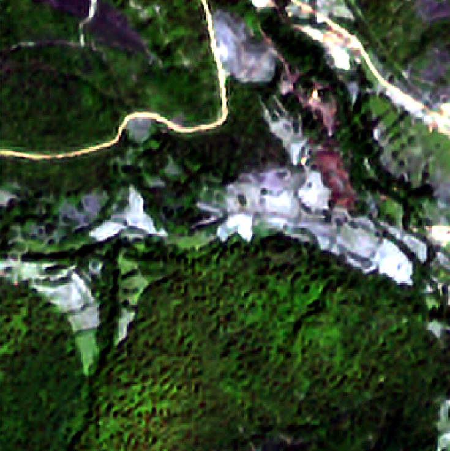
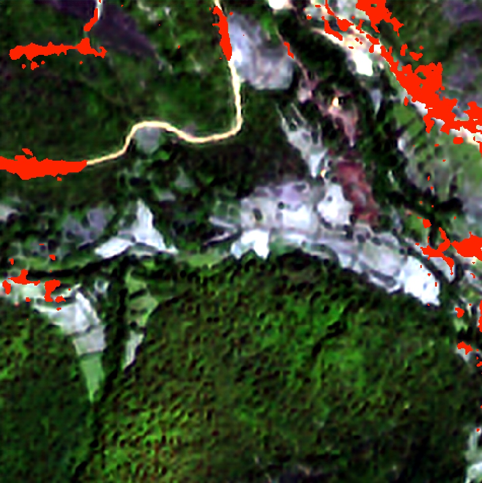
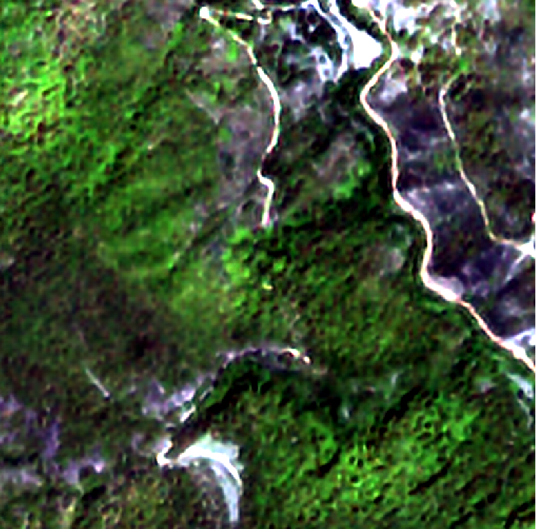
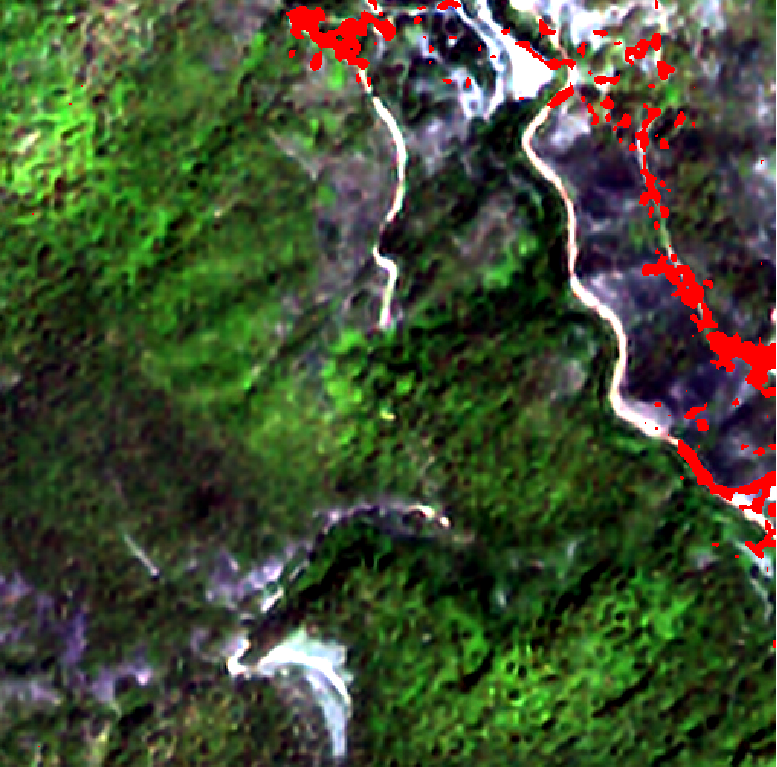

# Sentinel-2 Road Detection: Super-Resolution and Semantic Segmentation

> 🇬🇧 This is the English version of the README. [Leer en español](/README.md)

## Problem and Impact
Mapping rural roads and firebreaks in densely forested areas is a crucial challenge for fire prevention. This project automates the extraction of these geometries by processing data from the Copernicus API, improving their native resolution (from 10 m/px to 2.5 m/px) and applying computer vision.

> **Note:** Although the PNOA program offers extremely high resolutions (0.25-0.5 m/px), flights are conducted every 3 or more years. Sentinel-2 provides near real-time captures, which is vital for logistics updates.

## Architecture and Tech Stack
- **Languages and Frameworks:** Python, PyTorch, Transformers (Hugging Face)
- **Base Models:** [Sen2SR](https://github.com/ESAOpenSR/SEN2SR) (Super-Resolution) and [SegFormer](https://huggingface.co/docs/transformers/model_doc/segformer) [mit-b3](https://huggingface.co/nvidia/mit-b3) (Segmentation)
- **Data and GIS:** Sentinel-2 Imagery, [PNOA](https://pnoa.ign.es/) Orthophotos, QGIS, Rasterio, Xarray, GDAL

## Technical Challenges Solved
- **SegFormer Architecture Adaptation to 4 channels:** The original input layer of the SegFormer mit-b3 model (originally designed for RGB) was modified using PyTorch to process a fourth band (Near-Infrared - NIR), crucial for vegetation analysis.
- **Mass downloading and raster adaptation (resolution from 10 m/px to 2.5 m/px, conversion from 10 bands to 4 bands):** Achieved mass downloading of images to train a Sen2SR model with images captured by PNOA (originally at 0.25-0.5 m/px) to achieve a resolution of 2.5 m/px, using only the R, G, B, and NIR bands from Sentinel-2 (originally at 10 m/px).
- **Mass downloading and error handling of Sentinel-2 satellite imagery:** Achieved mass downloading of Sentinel-2 images using *POIs (Points of Interest)* for subsequent Super-Resolution, handling errors, managing auto-authentication with the Copernicus API, and automatically processing their respective Coordinate Reference Systems (CRS).
- **Mass Super-Resolution:** Implementation of scripts for massive inference on the previously downloaded data.
- **Geospatial Error Handling:** Dynamic memory cropping management to resolve matrix mismatches (*Off-By-One pixel errors*) generated by QGIS (GDAL) rounding in spatial masks.
- **Tiling and Normalization:** Automated scripting to split large 2048x2048 TIFs into 512x512 patches, applying consistent percentile clipping (2nd-98th) for both training and inference.

## Preliminary Results (v0.1)
The model identifies the elongated and sinuous shapes typical of rural roads, demonstrating that the geometric base has been learned. It has also developed high sensitivity to bare soil (useful for detecting firebreaks).

(Super-Resolved Image at 2.5 m/px near Villablino, León. Coords: 42°57'20.9"N 6°24'04.7"W)

(Preliminary Model v0.1 Mask)

Super-Resolved Image at 2.5 m/px near Villablino, León. Coords: 42°55'14.6"N 6°16'55.8"W

(Preliminary Model v0.1 Mask)

## Roadmap
- [ ] **Hard Negative Mining:** Inclusion of patches with large earth clearings without roads to prevent false positives.
- [ ] **Topological Optimization:** Improvement of the loss function (e.g., implementation of *clDice* or *TopoLoss*) to heavily penalize road line fragmentation.
- [ ] Interactive demo deployment.
- [ ] Reproducibility guide.